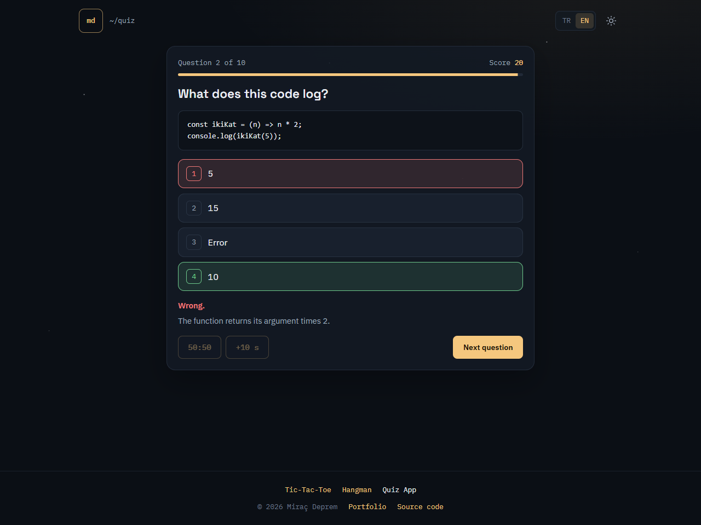
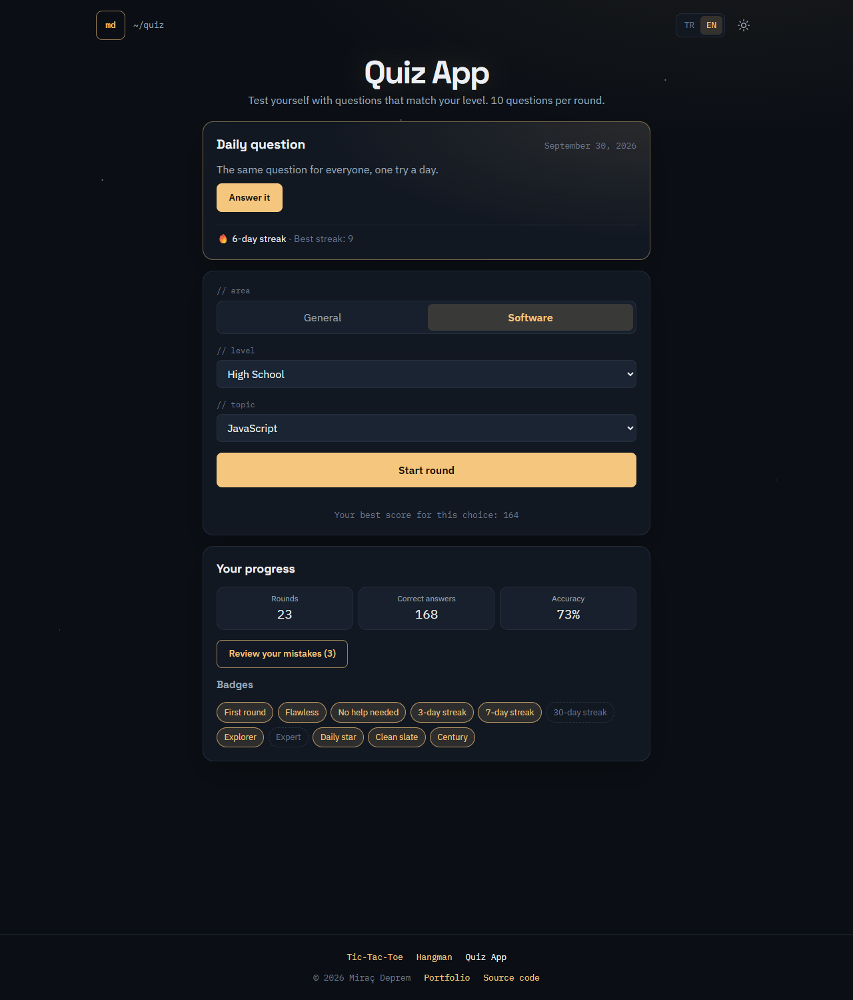
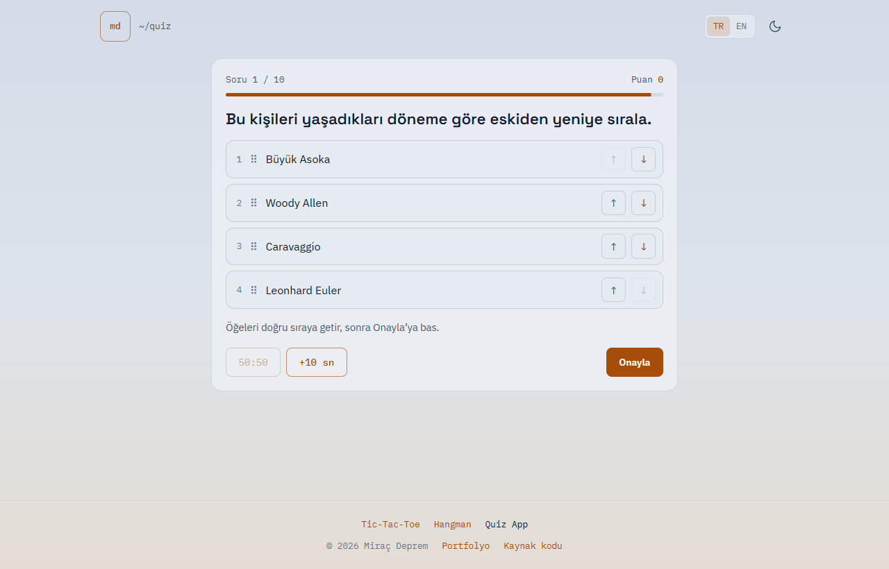
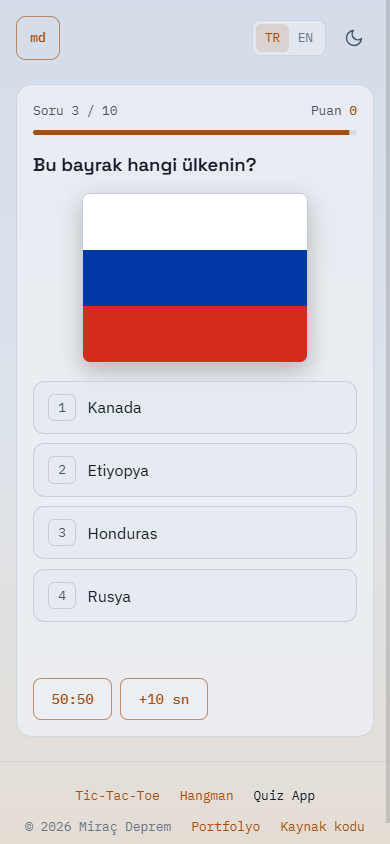
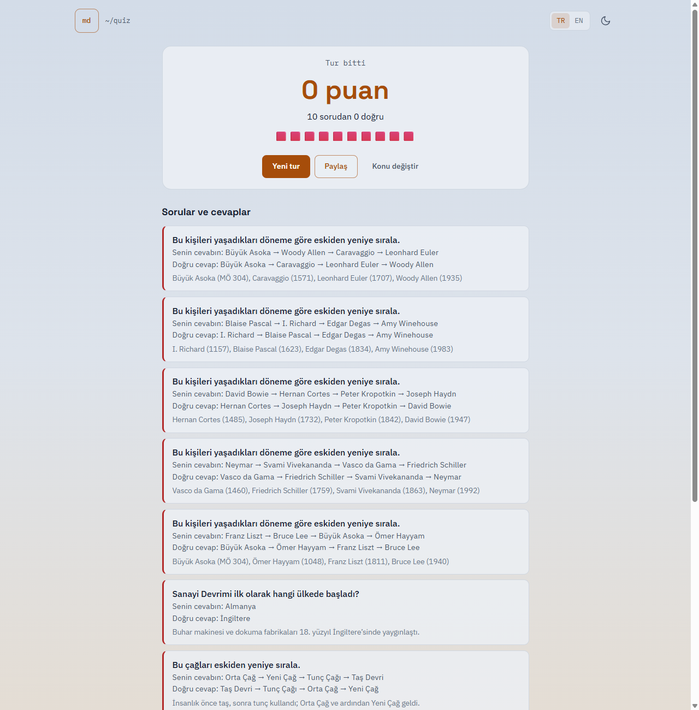

# Quiz App

**English** | [Türkçe](README.tr.md)

A quiz platform for testing yourself now and then:
- Questions that match your school level, from primary school to a master's degree.
- A software track.
- A daily question that is the same for everyone.
- Thousands of questions generated from real data.

Answers never reach the browser before you answer, so the quiz cannot be cheated by opening the developer tools.

**Live demo:** [quiz.miracdeprem.com](https://quiz.miracdeprem.com)



## Features

- **Five levels for every area:** Primary School, Middle School, High School, University and Master's.
  - **General subjects:** Maths, Science, History, Geography, Literature and Art, General Knowledge, or all of them mixed.
  - **Software:** topics open up level by level.
    - Primary school: Coding Basics.
    - Middle school adds Algorithms, HTML and CSS, and Python.
    - High school (including vocational high schools) adds JavaScript, SQL, Git, Web Security and C#.
- **Questions from two sources:**
  - **A hand-written bank of 796 questions** in Turkish and English, each with a short explanation. Every "what does this code print?" question was checked by actually running the code with Python, Node.js or .NET.
  - **Generated questions from real data.** Templates build new questions from people (Wikidata), 129 countries, famous works and chemical elements. Maths questions get fresh numbers every time.
- **Four question types:**
  - Multiple choice.
  - Flag questions.
  - Chronological ordering, by drag and drop or with the ↑/↓ buttons.
  - "What does this code print?"
- **Rounds of 10 questions**
  - A timer and a speed bonus.
  - Two jokers: 50:50 and +10 seconds.
  - The correct answer and an explanation after every question, and a full review at the end.
- **No repeats:** questions you have already seen in a topic are not asked again until the pool runs out.
- **Daily question:** the same question for everyone, one try a day. The result can be shared to WhatsApp, X, LinkedIn, Telegram, Facebook or Instagram, or simply copied.
- **Progress, all stored in your own browser:**
  - Daily streak.
  - Accuracy statistics and the best score per topic and level.
  - 11 badges.
  - A **"My mistakes"** round that repeats the questions you got wrong until you get them right.
- **Turkish and English**, and a dark and a light theme matching [my portfolio](https://www.miracdeprem.com).
- **Accessible:**
  - Keys 1–4 to answer and Enter to continue.
  - Screen-reader announcements.
  - Respects "reduce motion".
- **Feedback:** a small button opens a form (name optional, email or phone, message) that sends straight to me through my portfolio site.

## How cheating is prevented

The whole quiz runs on the server (Vercel Functions).

| What | How |
|---|---|
| Answers | The question bank lives in a folder that is never served. The browser receives one question at a time, without its answer. |
| Round state | Kept in a token encrypted with **AES-256-GCM**: the browser holds it but can neither read nor change it. |
| Replaying a token | Every token works **once**. Upstash Redis remembers used ones, so you cannot send a fake answer, learn the right one and answer again. |
| Time and score | Measured and calculated on the server; the timer bar in the browser is only a display. |
| Flag images | Sent inside the question as data URLs, cleaned of any country code, so a file name cannot give the answer away. |
| Abuse | Rate limiting (120 requests per minute per IP), server-side validation of every field, a same-origin check and generic error messages. |

**Known limits.** There are no accounts, so some things cannot be enforced:
- The daily "one try" is per browser.
- Streaks and statistics live in local storage.
- The repository is public, so the question bank can be read on GitHub.

## Screenshots

| Home: daily question, streak, badges | Ordering question (Turkish, light theme) | Flag question on a phone |
|---|---|---|
|  |  |  |



## Tech Stack

- HTML, CSS, JavaScript (ES modules, no framework, no build step)
- Vercel Functions (Node.js) for the API, Upstash Redis (through its REST API, no SDK)
- `node:crypto` for AES-256-GCM tokens and secure random numbers
- `node --test`: 142 unit tests
- **No npm dependencies** at all

## Installation

Play online at [quiz.miracdeprem.com](https://quiz.miracdeprem.com), or run it locally (Node.js 20.12 or newer).

1. Clone the repository:
   ```bash
   git clone https://github.com/MrcDprm/quiz-app.git
   cd quiz-app
   ```
2. Create a `.env` file. Copy `.env.example` and fill in `QUIZ_TOKEN_KEY` with a random key:
   ```bash
   node -e "console.log(require('crypto').randomBytes(32).toString('base64'))"
   ```
   Keep `QUIZ_DEV=1` to use an in-memory store instead of Redis.
3. Start the local server:
   ```bash
   npm run dev
   ```
4. Open `http://localhost:5173`. The development server serves `public/` and runs the same API functions that Vercel runs.

Run the tests with:
```bash
npm test
```

### Project structure

```
public/                 The only folder that is served: page, styles, browser modules
  src/main.js           Screens, timer, answers, results
  src/progress.js       Statistics, mistakes list, seen questions, badges
  src/storage.js        Settings in localStorage, validated on every read
api/                    Vercel Functions: round, daily, review, answer, joker
lib/
  quiz.js               Round rules: timing, scoring, jokers
  token.js              AES-256-GCM round tokens
  store.js              Single-use tokens and rate limiting (Upstash REST or memory)
  http.js               Validation, origin check, rate limit, generic errors
  catalog.js            Loads the bank, mixes bank and generated questions, skips seen ones
  generators.js         Template engine; templates/ has people, countries, works, elements, maths
data/                   Question bank, data for the generators, flags (never served)
scripts/                Local server and the Wikidata fetch script
tests/                  Unit tests
```

## What I Learned

- **Never trusting the browser.** At first I planned to send the questions with their answers. Then I realised anyone could open the network tab and read them. So I moved the rules, timing and scoring to the server, and the browser only shows one question at a time. Even the random seed used to shuffle the options stays secret, because with the seed and the open-source code the answer could be worked out.
- **Stateless servers with encrypted tokens.** Instead of keeping each round in a database, I encrypt the round state with AES-256-GCM and hand it to the browser. GCM both hides the data and detects any change. To stop the same token being used twice, I store its ID once in Redis with `SET ... NX`, which is atomic.
- **Seeded randomness.** With a small seeded generator (mulberry32) the same seed always gives the same shuffle. That made the tests repeatable and gave me the daily question for free: the date becomes the seed, so everyone gets the same question without storing it anywhere.
- **Generating questions from data.** I wrote a script that pulls famous people from Wikidata with SPARQL. I also learned how to make generated questions fair: wrong options are picked from the same kind of thing, and a question is skipped if two options could both be right.
- **Testing what I write.** Every code question is run for real before it goes into the bank; this caught several of my own mistakes. A test that checks browser module imports caught a file I had committed empty.
- **Pointer Events.** One set of pointer events handles mouse, touch and pen for drag and drop. The ↑/↓ buttons stay for keyboard and screen-reader users.
- **Building without dependencies.** The only external service is Redis, which I call through its REST API with `fetch`. There is nothing to install and no vulnerable package to update.

## Credits

- Data about people: [Wikidata](https://www.wikidata.org) (CC0).
- Flags: [flag-icons](https://github.com/lipis/flag-icons) by Panayiotis Lipiridis (MIT); the licence is in `data/flags/LICENSE`.

## Future Plans

- Accounts, so streaks and statistics follow you across devices and the daily question can have a leaderboard.
- AI-generated rounds on any topic you type in.
- More specialist areas besides software.
- Verifiable result links for sharing.

## License

[MIT](LICENSE)
